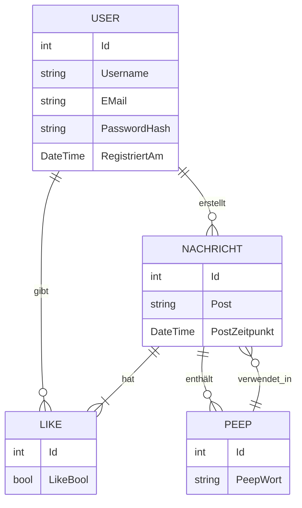

 
?? Klicken zum Aufklappen

markdown

```mermaid
erDiagram
    USER ||--o{ NACHRICHT : erstellt
    USER ||--o{ LIKE : gibt
    NACHRICHT ||--|{ LIKE : hat
    NACHRICHT ||--o{ PEEP : enthält
    PEEP ||--o{ NACHRICHT : verwendet_in

    USER {
        int Id
        string Username
        string EMail
        string PasswordHash
        DateTime RegistriertAm
    }

    NACHRICHT {
        int Id
        string Post
        DateTime PostZeitpunkt
    }

    LIKE {
        int Id
        bool LikeBool
    }

    PEEP {
        int Id
        string PeepWort
    }
```

